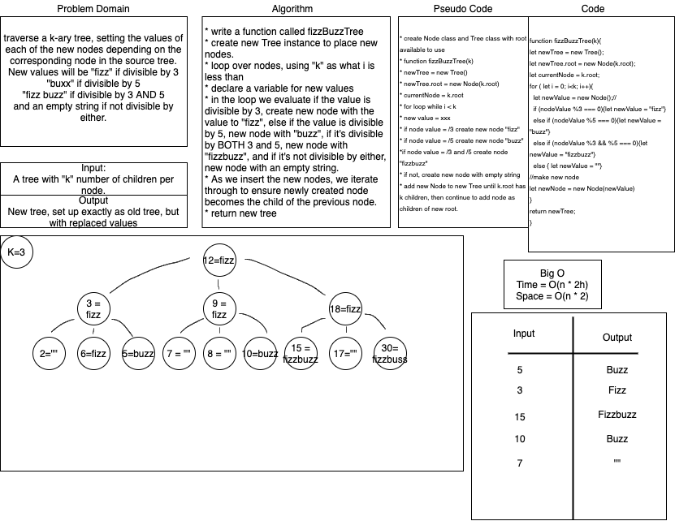

# FizzBuzzTree

> Tina Myers, Stacy Burris, Sara Strasner

## Challenge

> Take a tree with k child nodes off each root, and return a new tree that changes values divisible by 3 to "fizz", by 5 to "buzz, by both to "fizzbuzz" and by neither to an empty string.

## Approach & Efficiency

> Big O time of (n * 2h)
> Big O space of (n * 2)

## Whiteboard;

