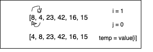
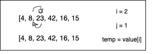
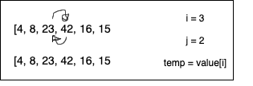
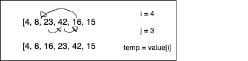

# Blog

> Step one: Compares the first and second items in the array. If the first element is smaller than the second element, they stay put. If not, they flip indexes.

> Step two: Compares the now second item with the third. If the second item is smaller than the third, it stays put, if not, they switch.

> Step three: Compares the third with the fourth. If the third item is smaller than the third, it stays put. If 3 > 4, 4 is then compared to 2, and so on, until it finds it's home.

> Step four: Compares the fourth with the fifth. If the fourth item is smaller than the fifth, it stays put. If 4 > 5, 5 is then compared to 3, and so on, until it finds it's home.

> Step five: Compares the fifth with the sixth. If the fifth item is smaller than the sixth, it stays put. If 5 > 6, 6 is then compared to 4, and so on, until it finds it's home.
