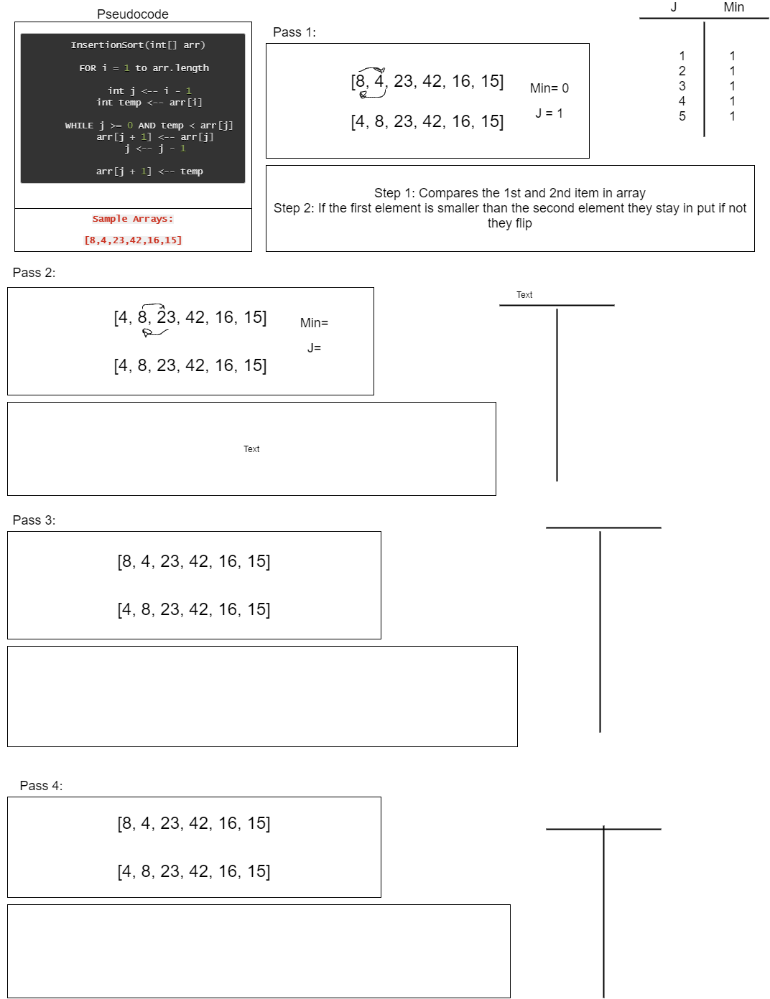

# Code Challenge: Insertion Sort

## CC=Code Challenge/Pair Programming

Tina Myers

## Languages:

javascript, jest

## Approach/Efficiency:

O(n^2) for time and space

## API:

InsertionSort: sorts a provided array from smallest value to largest value

### Sources:

- Sara Strasner, Stacy Burris (Day 1)

### Whiteboard (linked List insertions):

