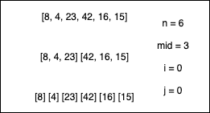
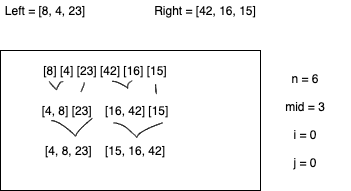
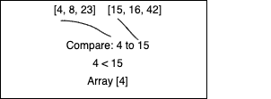
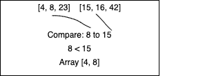
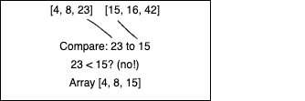
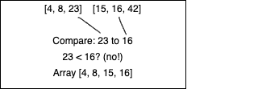
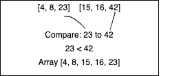
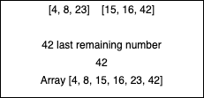

# Merge Sort

> 
> We start with an array that is provided, and we want to use the merge sort algorithm, which divides the array in half over and over until each array is a single number.
> 
> We then start putting them back together, sorting along the way until there are two arrays (each sorting the first and second half of the original array).
> 
> We then compare the first number of the left array to the first number of the second array, placing the smaller in the first spot of our new array. In this case, the first number of the left array is the smallest, and gets placed into the array.
> 
> Next, we compare the second number of the left array to the remaining first number of the right array. Again, we return the smaller of the two, which in this case is the number from the left array.
> 
> We move on, comparing the third number from the left array to the same first number of the right array. In this case, the number from the right array is smaller and gets placed in the new array.
> 
> We move on and compare the second number from the right array to the third number of the left array. The number in the right array is again smaller, and is placed in the array.
> 
> We then compare the final two numbers, the last of both the right and the left. The number from the left array is smaller and is placed in the array.
> 
> The remaining number in this case (or numbers in another scenario where all of the larger nubmers are in one array) is added to the array at the end.
