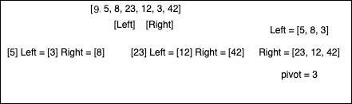
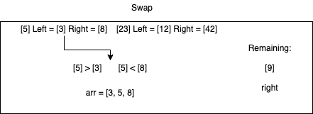
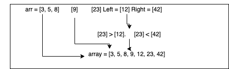

# Quick Sort

> 
> Step One: Find the pivot element (the first element of the array). Compare the pivot element to all other elements in the array. All smaller elements are moved to the [left] array, while all larger elements are moved to the [right] array. Recursively call this same function until all elements are a left and a right.
> 
> Step Two: Use the swap function to rearrange the elements in the array. For the left array, compare the left-left to the left-right and place the smallest one in the index [0] in the array. Then compare the larger of the two to the next element in the left and so on until all elemtents in left are inserted.
> 
> Step three: Place the pivot element in the array, and complete step two with the [right] array. When all elements are arranged properly in the array, return the array.