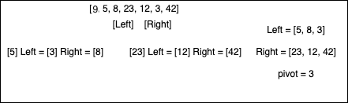
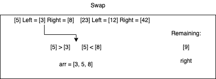
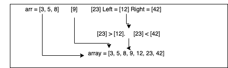

# Code Challenge: Quick Sort

## CC=Code Challenge/Pair Programming

Tina Myers

## Languages:

javascript, jest

## Approach/Efficiency:

O(n * n-1) for time and space

## API:

Quick Sort: sorts a provided array from smallest value to largest value by sorting the array into a left and right that contains numbers either larger or smaller (left=small, right=large) than the pivot element (array[0]). Recursively sorts and swaps until array is in order.

### Sources:

- Sara Strasner, Stacy Burris

### Whiteboard (each image for blog)

