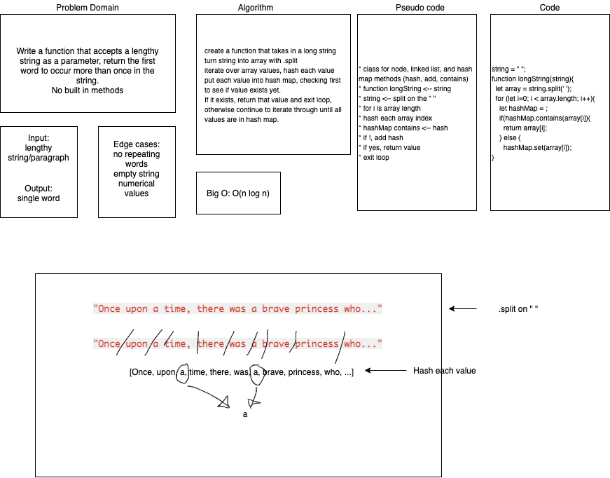

# Challenge Summary

> Repeated Word: completed by Tina Myers, Sara Strasner, and Stacy Burris

## Challenge Description

> Write a function that accepts a lengthy string parameter.
> Without utilizing any of the built-in library methods available to your language, return the first word to occur more than once in that provided string.

## Approach & Efficiency

> Big O = O(n log n)

## Solution

