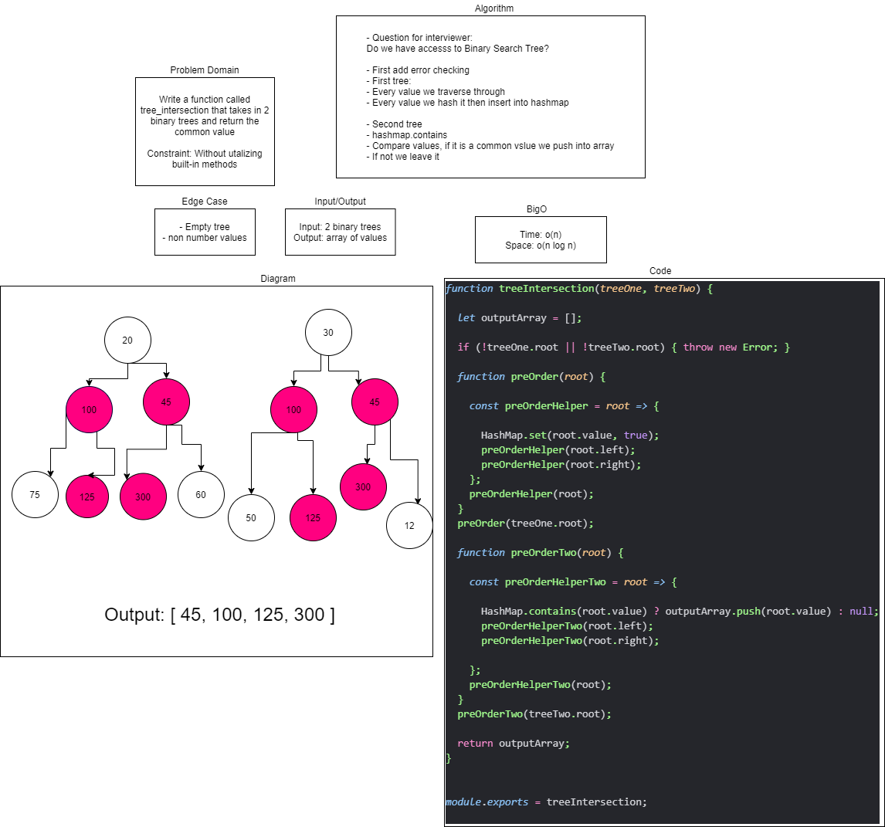

# Challenge Summary

> Tree Intersection: completed by Tina Myers, Sara Strasner, and Stacy Burris

## Challenge Description

> Find common values in two binary trees.
> Write a function called tree_intersection that takes two binary tree parameters.
> Without utilizing any of the built-in library methods available to your language, return a set of values found in both trees.

## Approach & Efficiency

> Big O = O(n log n)

## Solution

